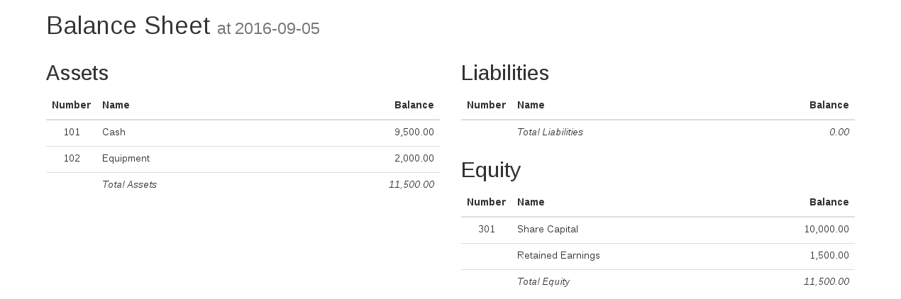
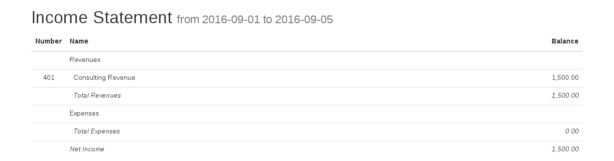

# Ledger

Ledger is a REST-ful double-entry accounting software. Its main principle is
_simplicity_. Currently it allows you to:

1. Create a chart of accounts.
2. Record transactions affecting the accounts.
3. Generate a balance sheet corresponding to _any_ point in time.
4. Generate an income statement corresponding to _any_ interval of time.

## Installation

You need Python 2.7 and `virtualenvwrapper`.

```bash
# Step 1: Clone the repository
git clone https://github.com/gregnavis/ledger.git ledger

# Step 2: Enter the project root
cd ledger

# Step 3: create a virtual environment
mkvirtualenv -a "${PWD}" -r requirements.txt

# Step 4: set environment variables
export FLASK_APP=webapp.py

# Step 5: initialize the database
flask init

# Step 6: run!
flask run --host=0.0.0.0
```

Ledger is listening on port 5000 on _all_ interfaces.

## Usage


First, you need to create the chart of accounts. You can do this by `POST`-ing
the following JSON to `/accounts`:

```
{"name":"Cash","code":"101","type":"asset"}
```

This will create an account named _Cash_. The name of an account is only for
display purposes. Accounts are internally references using the code. For
example, if you `GET` `/accounts/101` the server will return the data you've
posted to created the account.

There are five types of accounts: `asset`, `liability`, `equity`, `revenue` and
`expense`. Before recording your first transaction, you need some other
accounts, say _Equipment_ (an asset account) and _Share Capital_ (an equity
account). You can create them by `POST`-ing:

```
{"name":"Equipment","code":"102","type":"asset"}
```

and

```
{"name":"Share Capital","code":"301","type":"equity"}
```

You'll also need a revenue account:

```
{"name":"Consulting Revenue","code":"401","type":"revenue"}
```

For simplicity, we'll skip expenses.

With the chart of accounts in place, you're ready to start recording
transactions. In order to record the initial investment of $10,000 `POST` the
following to `/transactions`:

```
{
  "date":"2016-09-01",
  "description":"Record the initial investment",
  "items":[
    {"account_code":"101","amount":1000000},
    {"account_code":"301","amount":-1000000}
  ]
}
```

The convention is that _positive amounts are debits, negative are credits_.
Also, all amounts are assumed to be expressed in cents hence 1000000.

If you buy an asset, e.g. a laptop for $2,000, you can record it with:

```
{
  "date":"2016-09-02",
  "description":"Buy a computer",
  "items":[
    {"account_code":"101","amount":-200000},
    {"account_code":"102","amount":200000},
  ]
}
```

A consulting service for Acme, Inc., paid $1,500 in cash, can be recorded as:

```
{
  "date":"2016-09-03",
  "description":"Consulting for Acme, Inc.",
  "items":[
    {"account_code":"101","amount":150000},
    {"account_code":"401","amount":-150000},
  ]
}
```

To see the balance sheet on 5 September 2016 go to
`/balance-sheets/2016-09-05.html`. You should see



Similarly, if you go to `/income-statements/2016-09-01-to-2016-09-05.html` you
should see:



To sum up:

* `POST /accounts` creates an account.
* `GET /accounts/<code>` retrieves account information.
* `POST /transactions` record a transaction.
* `GET /balance-sheets/<YYYY-MM-DD>.html` generates a balance sheet on a given
  day.
* `GET /income-statements/<YYYY-MM-DD>-to-<YYYY-MM-DD>.html` generates an income
  statement corresponding to a given period of time.

## Under the Hood

Ledger has minimal dependencies. It stores data in SQLite 3 using the built-in
`sqlite3` module. The web component uses [Flask](http://flask.pocoo.org/) and
[Jinja 2](http://jinja.pocoo.org/).

## Missing Features

Financial accounting is a huge subject. Ledger is _not_ a fully-fledged
accounting system. Below is a list of things that it lacks:

* Adjusted and unadjusted trial balances.
* Statement of changes in equity.
* _Contra_ accounts.
* Classified balance sheets and income statements.
* Subledgers.
* Automatic capitalization, depreciation and amortization.
* Industry-specific financial statements (e.g. income statements reporting cost
  of goods sold and gross profit in a merchandising business).
* Inventor systems (perpetual and periodic).
* Cost flow assumptions (specific identification, FIFO and weighted average).
* Estimation of balance in merchandise inventory (gross profit method and retail
  inventory method).
* Notes to financial statements.
* Security features (e.g. SSL, authentication).
* Configuration knobs (e.g. database location, network interface to use).

If you'd like to help to implement a feature feel free to [drop me a
line](mailto:contact@gregnavis.com). I'll try to give you some guidance.

## Author

Ledger is developed and maintained by [Greg Navis](http://www.gregnavis.com/).
